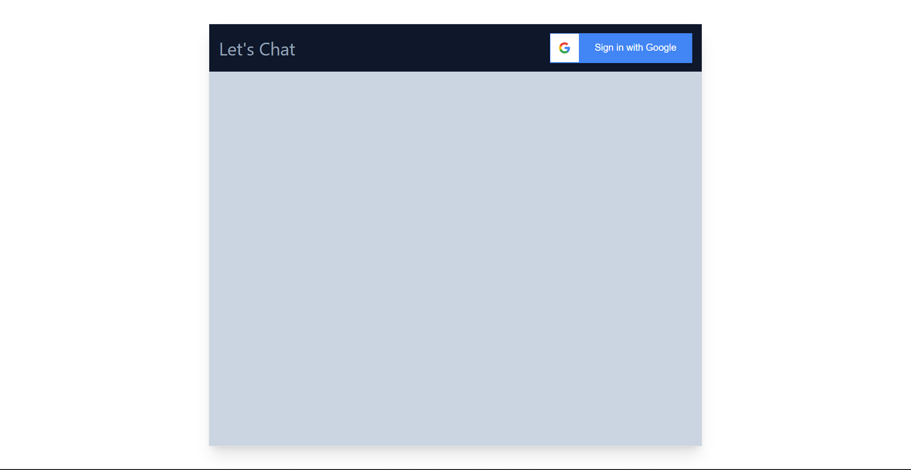
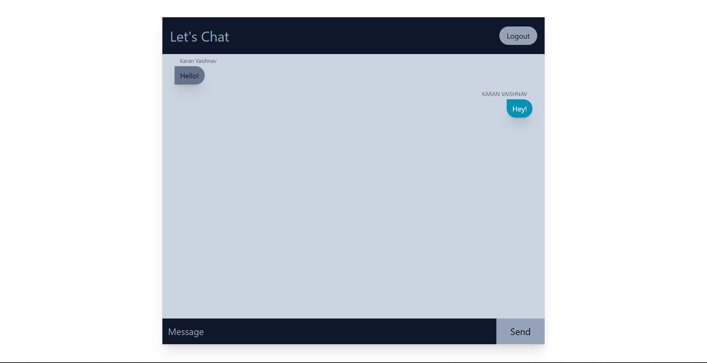

# Let's Chat 💬

## Overview
Let's Chat is a web application to bring people and ideas "together" despite geographical barriers. It is made up of 2 applications: the client application, which runs on the user's PC, and the server application, which runs on any PC on the network.


## Website Preview




## Tech Used / Dependencies

- react 
- firebase
- react-firebase-hooks
- react-google-button
- tailwindcss


## Prerequisites

### Install Node JS

Refer to https://nodejs.org/en/ to install nodejs

### Install create-react-Application

Install create-react-app npm package globally. This will help to easily run the project and also build the source files easily. Use the following command to install create-react-app

```bash
npx create-react-app lets_chat
```


## Live Application URL
https://let-s-chat.netlify.app/


## Running The Project
- Clone the project into local
- Install all the npm packages. Go into the project folder and type the following command to install all npm packages
```bash
npm install
```
- In order to run the application Type the following command
```bash
npm start
```
- Now Application will Runs on localhost:3000
